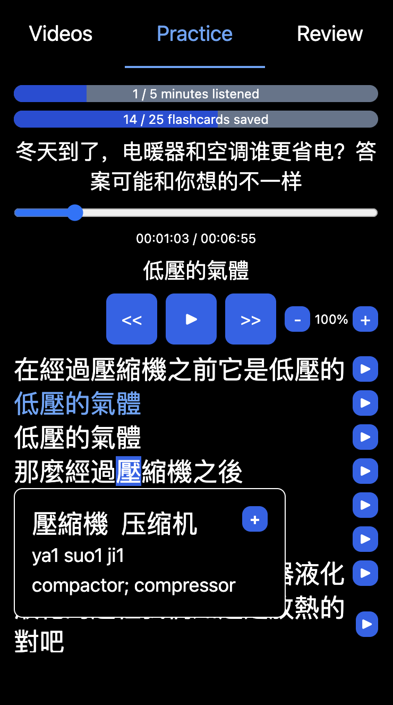

# Mandarin Parroting

The goal of this web app is to make it as easy as possible to get good at Mandarin Chinese by parroting YouTube videos.

["In my opinion, parroting is the best way to improve your oral fluency, bar none - especially if you care about your accent." - Lele Farley](https://youtu.be/z6OVuSRL5oI&t=110s)

## How to use this web app

1. Find a Mandarin YouTube video with a transcript that you're interested in understanding and parroting ([Here are some recommended YouTube channels from the Refold Mandarin community](https://zenith-raincoat-5cf.notion.site/a9369f84c1eb4aa3939441d723f3ab07?v=257cd5b4f0e7413bb857d5e1192f2ca9)).
2. Copy the video ID and download the transcript VTT file from [Invidious](https://docs.invidious.io/instances).
3. Paste the YouTube video ID into this web app and upload the transcript VTT file that you downloaded.
4. Parrot, look up vocab, and save all the unknown vocab in the YouTube video, then review the generated flashcards later.

## How to effectively parrot

1. If you're unfamiliar with parroting, watch [Lele Farley's video on parroting](https://youtu.be/z6OVuSRL5oI).
2. Slow down the speed of the video so you can parrot more easily.
3. Listen to one episode on one topic on repeat every day for one week.
4. Use videos that you're interested in that have a transcript.
5. Learn to love the details of the language.

## Features

- Saves and organizes videos, transcripts, and vocab
- Comes with a Mandarin Chinese dictionary built in so you can look up unknown Mandarin words
- Text-to-speech vocab flashcards with a spaced-repetition algorithm
- Keeps track of your stats and daily goals to keep you motivated so you make progress quickly
- Works on desktop (Windows, Mac OS, Linux) and mobile (Android, iOS) as an installable progressive web app

## Screenshots

  
  
  
  

## Credits

- This web app was inspired by [Lele Farley's video on parroting](https://youtu.be/z6OVuSRL5oI).
- [CC-CEDICT](https://www.mdbg.net/chinese/dictionary?page=cedict) is used for the Mandarin Chinese dictionary.
